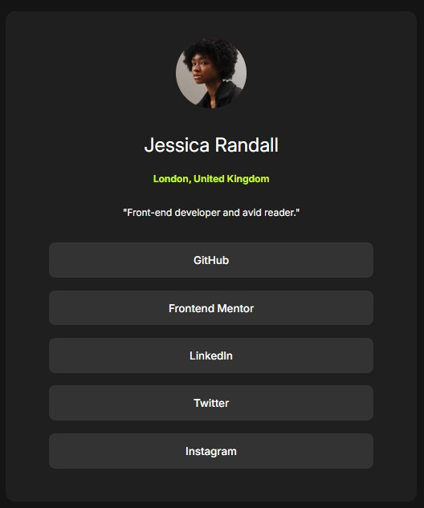

# Frontend Mentor - Social links profile solution

This is a solution to the [Social links profile challenge on Frontend Mentor](https://www.frontendmentor.io/challenges/social-links-profile-UG32l9m6dQ). Frontend Mentor challenges help you improve your coding skills by building realistic projects.

## Table of contents

- [Overview](#overview)
  - [The challenge](#the-challenge)
  - [Screenshot](#screenshot)
  - [Links](#links)
- [My process](#my-process)
  - [Built with](#built-with)
  - [What I learned](#what-i-learned)
  - [Continued development](#continued-development)
  - [Useful resources](#useful-resources)
- [Author](#author)
- [Acknowledgments](#acknowledgments)

## Overview

### The challenge

Users should be able to:

- See hover and focus states for all interactive elements on the page

### Screenshot

### Links

- Solution URL: [https://github.com/msakuma-dev/FrontendMentor-Social-Links-Profile](https://github.com/msakuma-dev/FrontendMentor-Social-Links-Profile)
- Live Site URL: [https://msakuma-dev.github.io/FrontendMentor-Social-Links-Profile/](https://msakuma-dev.github.io/FrontendMentor-Social-Links-Profile/)

## My process

### Built with

- Semantic HTML5 markup
- BEM Methodology
- CSS custom properties
- Flexbox

### What I learned

I'm pretty happy to get more understanding how CSS works. Specially how some properties don't pass to the child, like flex.

### Continued development

Still working on how to layout things properly and basic understanding of CSS.

## Author

- Website - [Max Sakuma](https://github.com/msakuma-dev/)
- Frontend Mentor - [@msakuma-dev](https://www.frontendmentor.io/profile/msakuma-dev)
